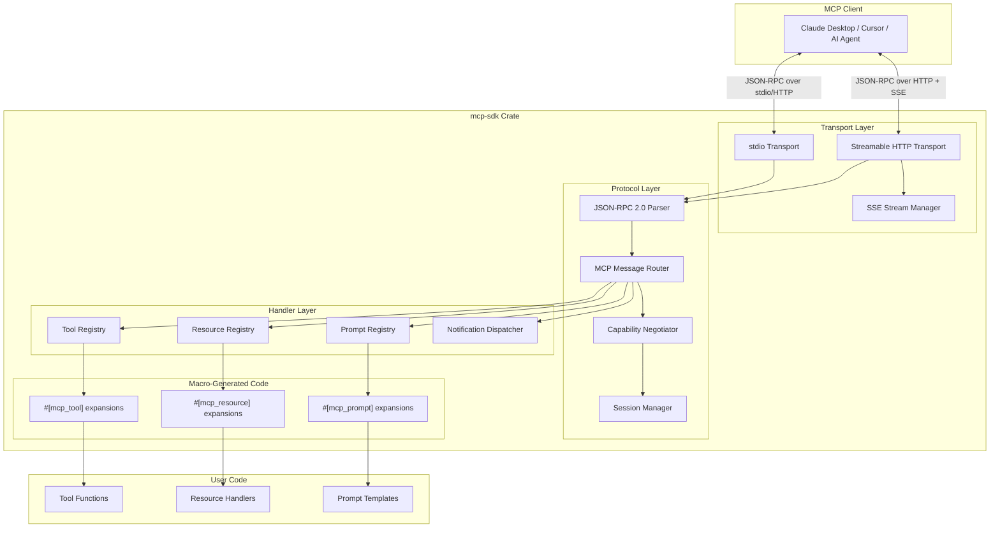
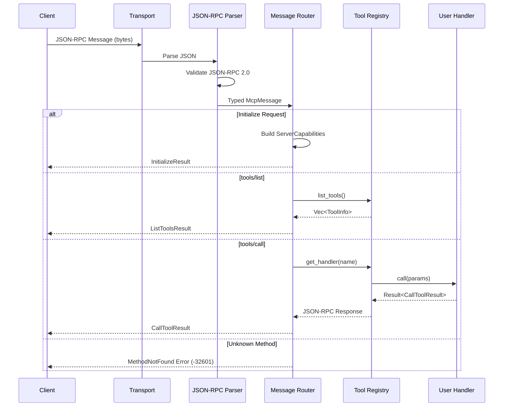
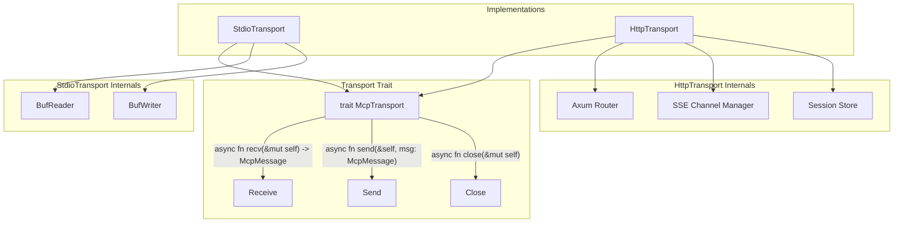
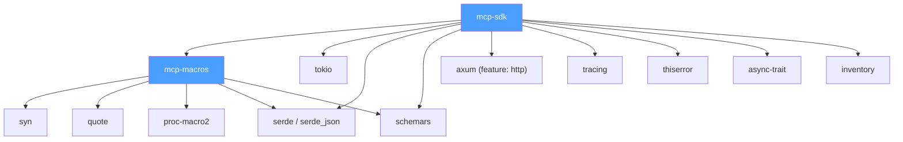
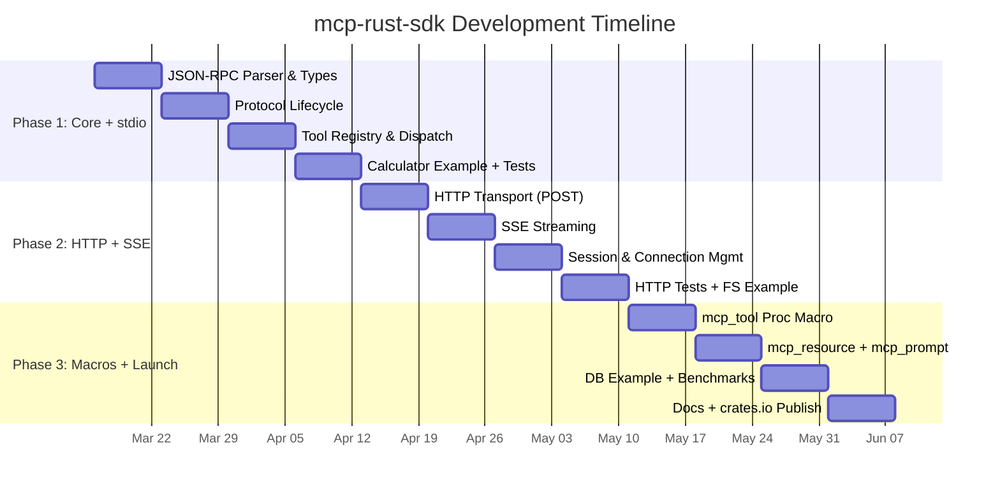
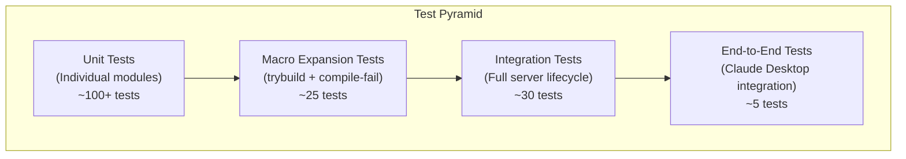
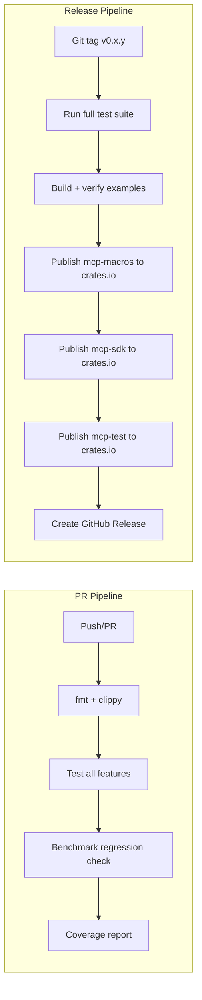

# Product Requirements Document: mcp-rust-sdk

**Document Version:** 1.0
**Date:** 2026-03-13
**Author:** Product Management
**Status:** Approved for Implementation
**Classification:** Open Source / Public

---

## Table of Contents

1. [Executive Summary](#1-executive-summary)
2. [Problem Statement](#2-problem-statement)
3. [Goals & Non-Goals](#3-goals--non-goals)
4. [Target Users & Personas](#4-target-users--personas)
5. [User Stories & Requirements](#5-user-stories--requirements)
6. [Functional Requirements](#6-functional-requirements)
7. [Non-Functional Requirements](#7-non-functional-requirements)
8. [System Architecture](#8-system-architecture)
9. [API Design](#9-api-design)
10. [Protocol Compliance](#10-protocol-compliance)
11. [Transport Layer Design](#11-transport-layer-design)
12. [Proc Macro Design](#12-proc-macro-design)
13. [Crate Structure](#13-crate-structure)
14. [Development Phases & Milestones](#14-development-phases--milestones)
15. [Benchmarking Plan](#15-benchmarking-plan)
16. [Testing Strategy](#16-testing-strategy)
17. [Deployment & Distribution](#17-deployment--distribution)
18. [Success Metrics & KPIs](#18-success-metrics--kpis)
19. [Risk Assessment](#19-risk-assessment)
20. [Appendix](#20-appendix)

---

## 1. Executive Summary

### 1.1 Project Vision

**mcp-rust-sdk** (`mcp-sdk` on crates.io) is an open-source Rust crate that provides a complete, ergonomic, and high-performance SDK for building Model Context Protocol (MCP) servers. It brings the developer experience of Rust web frameworks like Axum and Actix-web to the MCP ecosystem through a macro-based API, enabling Rust developers to expose tools, resources, and prompts to AI applications with minimal boilerplate.

### 1.2 Problem Statement (Brief)

The MCP ecosystem is dominated by Python (FastMCP) and TypeScript implementations. There is no production-grade Rust SDK that combines ergonomic proc macros, full protocol compliance, and the performance characteristics that Rust uniquely delivers. This project fills that gap.

### 1.3 Target Users

Rust developers building AI-integrated tooling, systems engineers deploying MCP servers in resource-constrained or high-throughput environments, and MCP ecosystem contributors seeking a performant server implementation.

### 1.4 Key Differentiators

| Differentiator | Description |
|---|---|
| **Performance** | 10-50x lower memory usage and sub-millisecond latency vs Python FastMCP |
| **Type Safety** | Compile-time JSON Schema generation from Rust types via serde + schemars |
| **Ergonomics** | `#[mcp_tool]`, `#[mcp_resource]`, `#[mcp_prompt]` proc macros eliminate boilerplate |
| **Safety** | Rust's ownership model prevents data races, memory leaks, and undefined behavior |
| **Transport Flexibility** | First-class stdio, Streamable HTTP, and SSE support in a single crate |

### 1.5 Success Criteria

- Full compliance with MCP protocol version 2025-11-25
- Published to crates.io within 12 weeks of development start
- Documented benchmarks demonstrating at least 10x memory reduction vs FastMCP
- Three production-quality example servers shipped at launch

---

## 2. Problem Statement

### 2.1 The Rust MCP Gap

The Model Context Protocol, originally released by Anthropic in November 2024, has become the fastest-growing standard for connecting AI applications to external tools and data sources. As of March 2026, the MCP ecosystem includes:

- **Python SDK (FastMCP):** The dominant implementation, powering an estimated 70% of MCP servers across all languages. Provides an excellent developer experience through decorator-based tool registration.
- **TypeScript SDK:** The official reference implementation, widely used in Node.js environments.
- **Existing Rust options:** The official `rmcp` crate (v0.16.0) and community `rust-mcp-sdk` exist but have limitations in ergonomics, documentation maturity, and adoption.

Despite Rust's growing adoption in systems programming, cloud infrastructure, and CLI tooling, there is no Rust MCP SDK that matches FastMCP's developer experience while delivering the performance characteristics that Rust is known for.

### 2.2 Performance Limitations of Existing Implementations

Published benchmarks from multi-language MCP server comparisons reveal significant performance gaps:

| Metric | Python (FastMCP) | Go | Rust (projected) |
|---|---|---|---|
| Average Latency | 26.45ms | 0.855ms | <1ms |
| Throughput (req/s) | 292 | 1,600+ | 2,000+ |
| Memory Footprint | ~80-120MB | ~18MB | ~5-15MB |
| Startup Time | ~500ms | ~10ms | ~5ms |

Python's GIL, garbage collector overhead, and interpreter startup cost make it fundamentally unsuitable for scenarios requiring:

- **Edge deployments** with limited RAM (IoT, embedded systems)
- **High-concurrency servers** handling thousands of simultaneous MCP sessions
- **Latency-sensitive pipelines** where tool call overhead matters (agentic loops)
- **Container-optimized deployments** where small binary size and low memory reduce costs

### 2.3 Developer Experience Gap

Existing Rust MCP options require significant boilerplate:

```rust
// Current state: manual tool registration (verbose)
let tool = Tool {
    name: "calculate".to_string(),
    description: Some("Perform arithmetic".to_string()),
    input_schema: serde_json::json!({
        "type": "object",
        "properties": {
            "expression": { "type": "string" }
        },
        "required": ["expression"]
    }),
};
server.register_tool(tool, |params| async { /* handler */ });
```

**Our goal** is to reduce this to:

```rust
// Target state: macro-based (ergonomic)
#[mcp_tool(description = "Perform arithmetic")]
async fn calculate(expression: String) -> Result<String, ToolError> {
    Ok(eval(&expression)?.to_string())
}
```

### 2.4 Market Opportunity

- The `llm` crate for Rust has demonstrated strong demand for Rust + AI tooling.
- Rust's crates.io ecosystem serves millions of downloads daily across 150,000+ crates.
- MCP was the fastest-growing topic on GitHub in 2025.
- Organizations running MCP servers at scale (cloud providers, enterprises) are seeking lower-cost alternatives to Python deployments.

---

## 3. Goals & Non-Goals

### 3.1 Goals

| ID | Goal | Priority |
|---|---|---|
| G1 | Provide a complete MCP **server** SDK for Rust | P0 |
| G2 | Full compliance with MCP protocol version 2025-11-25 | P0 |
| G3 | Proc macro API for tools, resources, and prompts | P0 |
| G4 | Support stdio and Streamable HTTP transports | P0 |
| G5 | Auto-generate JSON Schema from Rust types | P0 |
| G6 | Publish to crates.io as `mcp-sdk` | P0 |
| G7 | Ship 3+ example servers (calculator, filesystem, database) | P1 |
| G8 | Benchmark suite comparing against FastMCP and TypeScript SDK | P1 |
| G9 | SSE streaming support for real-time responses | P1 |
| G10 | Comprehensive documentation on docs.rs | P1 |
| G11 | CI/CD pipeline with automated testing and publishing | P1 |
| G12 | Backward compatibility with MCP protocol version 2024-11-05 | P2 |
| G13 | Session management with resumability | P2 |
| G14 | TLS/SSL support for Streamable HTTP | P2 |

### 3.2 Non-Goals

| ID | Non-Goal | Rationale |
|---|---|---|
| NG1 | MCP **client** SDK | Scope limited to server-side; client may be a future project |
| NG2 | GUI or visual builder for MCP servers | Out of scope for a library crate |
| NG3 | Built-in authentication/authorization | Left to the application layer; SDK provides hooks |
| NG4 | Runtime tool loading (dynamic plugins) | Rust's static dispatch model favors compile-time registration |
| NG5 | Support for non-Tokio async runtimes | Tokio is the de facto standard; abstraction adds complexity |
| NG6 | Wasm compilation target | Future consideration, not initial scope |
| NG7 | Python/TypeScript bindings (FFI) | Separate project, not core SDK |

---

## 4. Target Users & Personas

### 4.1 Persona 1: Rust Application Developer ("Kira")

| Attribute | Detail |
|---|---|
| **Role** | Senior Software Engineer |
| **Background** | 3+ years Rust experience, builds CLI tools and web services |
| **Motivation** | Wants to expose existing Rust libraries as MCP tools for AI agents |
| **Pain Points** | Existing MCP SDKs require Python/TS; porting logic means maintaining two codebases |
| **Success Criteria** | Can add MCP server capability to an existing Rust project in <30 minutes |
| **Technical Level** | Expert in Rust, familiar with Tokio, serde, and Axum |

### 4.2 Persona 2: Systems/Infrastructure Engineer ("Raj")

| Attribute | Detail |
|---|---|
| **Role** | Platform Engineer at a cloud-native company |
| **Background** | Deploys microservices in Kubernetes, optimizes resource usage |
| **Motivation** | Needs MCP servers that run in resource-constrained containers |
| **Pain Points** | Python MCP servers consume 100MB+ RAM per instance; scaling is expensive |
| **Success Criteria** | MCP server binary under 10MB, memory usage under 20MB at runtime |
| **Technical Level** | Proficient in Rust, expert in infrastructure and deployment |

### 4.3 Persona 3: MCP Ecosystem Contributor ("Aisha")

| Attribute | Detail |
|---|---|
| **Role** | Open Source Developer and AI Tooling Enthusiast |
| **Background** | Actively contributes to MCP-related projects, maintains several MCP servers |
| **Motivation** | Wants to expand the MCP ecosystem with a Rust implementation |
| **Pain Points** | No well-documented, community-friendly Rust MCP SDK exists |
| **Success Criteria** | Clean API, good docs, easy to contribute to, active maintainer community |
| **Technical Level** | Intermediate Rust, expert in MCP protocol |

### 4.4 Persona 4: Performance-Critical Deployment Engineer ("Marcus")

| Attribute | Detail |
|---|---|
| **Role** | ML Infrastructure Engineer at a large enterprise |
| **Background** | Manages AI agent pipelines that make thousands of tool calls per minute |
| **Motivation** | Needs MCP servers with sub-millisecond latency and high throughput |
| **Pain Points** | Python FastMCP latency (26ms avg) creates bottlenecks in agentic loops |
| **Success Criteria** | P99 latency under 5ms, throughput above 2,000 req/s on a single core |
| **Technical Level** | Expert in systems performance, proficient in Rust |

---

## 5. User Stories & Requirements

### 5.1 Core User Stories

| ID | As a... | I want to... | So that... | Priority |
|---|---|---|---|---|
| US-01 | Rust developer | annotate a function with `#[mcp_tool]` and have it automatically exposed as an MCP tool | I can build MCP servers without writing JSON-RPC boilerplate | P0 |
| US-02 | Rust developer | have the SDK auto-generate JSON Schema from my function's typed parameters | tool input validation happens automatically based on Rust types | P0 |
| US-03 | Rust developer | start an MCP server over stdio with a single function call | my MCP server works immediately with Claude Desktop and other MCP clients | P0 |
| US-04 | Rust developer | start an MCP server over Streamable HTTP with minimal configuration | my MCP server can be deployed as a remote service | P0 |
| US-05 | Rust developer | return errors from tool handlers using Rust's `Result` type | error handling follows Rust idioms and maps cleanly to MCP error responses | P0 |
| US-06 | Systems engineer | deploy an MCP server as a statically-linked binary under 10MB | container images are small and startup is near-instant | P1 |
| US-07 | Rust developer | define MCP resources using `#[mcp_resource]` with URI templates | I can expose data sources without manual JSON-RPC implementation | P1 |
| US-08 | Rust developer | define MCP prompts using `#[mcp_prompt]` with typed arguments | I can create reusable prompt templates that clients can discover | P1 |
| US-09 | Rust developer | stream partial results back to the client during long-running tool calls | users see incremental progress rather than waiting for completion | P1 |
| US-10 | Platform engineer | run the MCP server with TLS termination | the server can be deployed behind a load balancer or exposed directly | P2 |
| US-11 | Rust developer | receive structured logging from the SDK via `tracing` | I can integrate MCP server logs with my existing observability stack | P1 |
| US-12 | Rust developer | access the raw MCP request context within tool handlers | I can implement custom authorization or audit logging | P1 |
| US-13 | MCP contributor | run the full MCP protocol compliance test suite against the server | I can verify correctness before deploying | P1 |
| US-14 | Rust developer | use the builder pattern to configure the MCP server programmatically | I have fine-grained control without macros when I need it | P1 |
| US-15 | Performance engineer | run included benchmarks comparing this SDK to FastMCP | I can justify the migration to Rust with quantitative data | P1 |

### 5.2 Advanced User Stories

| ID | As a... | I want to... | So that... | Priority |
|---|---|---|---|---|
| US-16 | Rust developer | register tools dynamically at runtime via the builder API | I can conditionally expose tools based on configuration | P2 |
| US-17 | Platform engineer | assign session IDs to Streamable HTTP connections | I can track and manage client sessions | P2 |
| US-18 | Rust developer | handle `notifications/cancelled` from clients | long-running tool calls can be gracefully aborted | P2 |
| US-19 | Rust developer | expose progress notifications during tool execution | the client can display a progress bar to the user | P2 |
| US-20 | Platform engineer | configure connection limits and timeouts on the HTTP transport | the server is protected against resource exhaustion | P2 |

---

## 6. Functional Requirements

### 6.1 P0 -- Must Have (Launch Blockers)

#### FR-01: Proc Macro -- `#[mcp_tool]`

| Attribute | Specification |
|---|---|
| **Description** | Procedural macro that converts a Rust async function into an MCP tool |
| **Input** | Async function with typed parameters and `Result<T, ToolError>` return type |
| **Behavior** | Generates: tool name (from function name), description (from macro attr or doc comments), JSON Schema (from parameter types via schemars), tool handler (wrapping the function in JSON-RPC dispatch) |
| **Attributes** | `name` (override tool name), `description` (tool description), `destructive` (marks tool as having side effects) |
| **Error Handling** | Compile-time errors for: non-async functions, unsupported parameter types, missing `Result` return type |

#### FR-02: JSON Schema Generation

| Attribute | Specification |
|---|---|
| **Description** | Automatically derive JSON Schema from Rust types for tool input validation |
| **Implementation** | Leverage `schemars` crate with `#[derive(JsonSchema)]` on parameter types |
| **Supported Types** | All serde-serializable types: primitives, `String`, `Vec<T>`, `Option<T>`, `HashMap<K,V>`, enums, nested structs |
| **Validation** | Schema is generated at compile time and embedded in the tool registration |

#### FR-03: stdio Transport

| Attribute | Specification |
|---|---|
| **Description** | MCP transport over standard input/output |
| **Protocol** | JSON-RPC 2.0 messages delimited by newlines |
| **Constraints** | Messages MUST NOT contain embedded newlines; stderr is available for logging |
| **Lifecycle** | Server reads from stdin, writes to stdout; connection ends when stdin closes |
| **Compatibility** | Must work with Claude Desktop, Cursor, and other MCP clients that launch subprocess servers |

#### FR-04: Streamable HTTP Transport

| Attribute | Specification |
|---|---|
| **Description** | MCP transport over HTTP using the Streamable HTTP specification (2025-03-26) |
| **Endpoint** | Single configurable HTTP endpoint supporting POST and GET methods |
| **POST Behavior** | Receives JSON-RPC requests; responds with either a single JSON-RPC response (`application/json`) or an SSE stream (`text/event-stream`) for streaming |
| **GET Behavior** | Opens an SSE stream for server-initiated messages (notifications) |
| **Session Management** | Server MAY assign session IDs via `Mcp-Session-Id` response header |
| **DELETE Behavior** | Terminates the session identified by `Mcp-Session-Id` header |
| **Built on** | Axum web framework with Tokio runtime |

#### FR-05: Protocol Lifecycle

| Attribute | Specification |
|---|---|
| **Initialize** | Handle `initialize` request; respond with server capabilities and protocol version |
| **Capability Negotiation** | Declare supported features: tools, resources, prompts, logging, notifications |
| **Initialized Notification** | Accept `notifications/initialized` from client to complete handshake |
| **Shutdown** | Handle graceful shutdown via transport close or explicit termination |

#### FR-06: Tool Listing and Calling

| Attribute | Specification |
|---|---|
| **tools/list** | Return array of registered tools with name, description, and inputSchema |
| **tools/call** | Dispatch to the correct handler based on tool name; validate arguments against schema; return result or error |
| **Pagination** | Support cursor-based pagination for `tools/list` when tool count exceeds threshold |
| **listChanged** | Emit `notifications/tools/list_changed` when tools are added or removed at runtime |

#### FR-07: JSON-RPC 2.0 Compliance

| Attribute | Specification |
|---|---|
| **Request Format** | `{"jsonrpc": "2.0", "id": <id>, "method": <string>, "params": <object>}` |
| **Response Format** | `{"jsonrpc": "2.0", "id": <id>, "result": <value>}` or `{"jsonrpc": "2.0", "id": <id>, "error": {"code": <int>, "message": <string>}}` |
| **Notification Format** | `{"jsonrpc": "2.0", "method": <string>, "params": <object>}` (no `id` field) |
| **Batch Requests** | Not required by MCP spec but should not cause errors |
| **Error Codes** | Standard JSON-RPC codes: -32700 (Parse error), -32600 (Invalid request), -32601 (Method not found), -32602 (Invalid params), -32603 (Internal error) |

### 6.2 P1 -- Should Have

#### FR-08: Resource Support

| Attribute | Specification |
|---|---|
| **`#[mcp_resource]`** | Proc macro to define MCP resources with URI templates |
| **resources/list** | Return registered resources with URI, name, description, and MIME type |
| **resources/read** | Return resource content (text or binary/base64) for a given URI |
| **URI Templates** | Support RFC 6570 URI templates for parameterized resources |
| **Subscriptions** | Support `resources/subscribe` for change notifications |

#### FR-09: Prompt Support

| Attribute | Specification |
|---|---|
| **`#[mcp_prompt]`** | Proc macro to define MCP prompt templates |
| **prompts/list** | Return registered prompts with name, description, and arguments |
| **prompts/get** | Return expanded prompt messages for given arguments |
| **Argument Types** | Support required and optional arguments with descriptions |

#### FR-10: SSE Streaming

| Attribute | Specification |
|---|---|
| **Description** | Server-Sent Events streaming within Streamable HTTP transport |
| **Use Case** | Streaming partial tool results, progress notifications, server-initiated messages |
| **Format** | Standard SSE format with `event`, `data`, and `id` fields |
| **Content Type** | `text/event-stream` |

#### FR-11: Structured Logging

| Attribute | Specification |
|---|---|
| **Integration** | `tracing` crate for structured, async-aware logging |
| **MCP Logging** | Support `logging/setLevel` to dynamically adjust server log verbosity |
| **Log Notifications** | Emit `notifications/message` with severity, logger name, and data |

#### FR-12: Progress Notifications

| Attribute | Specification |
|---|---|
| **Description** | Send `notifications/progress` during long-running operations |
| **Fields** | `progressToken`, `progress` (current), `total` (optional) |
| **Integration** | Provide a `ProgressReporter` handle accessible within tool handlers |

### 6.3 P2 -- Nice to Have

#### FR-13: Backward Compatibility

Support MCP protocol version 2024-11-05 via feature flag; auto-detect client protocol version during initialization.

#### FR-14: Session Resumability

Support reconnection to existing sessions via `Mcp-Session-Id` and `Last-Event-Id` headers in Streamable HTTP transport.

#### FR-15: Cancellation Support

Handle `notifications/cancelled` to abort in-progress tool calls via Tokio cancellation tokens.

#### FR-16: Roots Support

Handle `roots/list` requests and `notifications/roots/list_changed` notifications from clients.

---

## 7. Non-Functional Requirements

### 7.1 Performance Targets

| Metric | Target | Measurement Method |
|---|---|---|
| Tool call latency (echo tool, stdio) | < 0.5ms P50, < 2ms P99 | Criterion.rs benchmarks |
| Tool call latency (echo tool, HTTP) | < 1ms P50, < 5ms P99 | Criterion.rs + k6 load testing |
| Throughput (echo tool, HTTP) | > 2,000 req/s single core | k6 load testing |
| Memory usage (idle server, 10 tools) | < 5MB RSS | `/proc/self/status` or `jemalloc` profiling |
| Memory usage (100 concurrent sessions) | < 20MB RSS | Load testing with session tracking |
| Binary size (release, stripped) | < 8MB | `cargo build --release` + `strip` |
| Startup time (stdio) | < 10ms | Time-to-first-response benchmark |
| Startup time (HTTP) | < 50ms | Time-to-listening benchmark |

### 7.2 Reliability

| Requirement | Specification |
|---|---|
| **Panic Safety** | No panics in the SDK hot path; all errors returned as `Result` |
| **Memory Safety** | Zero `unsafe` blocks in public API; any internal `unsafe` must be documented and audited |
| **Graceful Degradation** | Malformed JSON-RPC messages return proper error responses, never crash the server |
| **Connection Resilience** | Transport layer handles disconnects without leaking resources |

### 7.3 Security

| Requirement | Specification |
|---|---|
| **Input Validation** | All incoming JSON-RPC messages validated against schema before dispatch |
| **No Arbitrary Code Execution** | SDK never evaluates user-supplied strings as code |
| **Dependency Audit** | All dependencies audited via `cargo audit`; zero known vulnerabilities at release |
| **Session ID Generation** | Cryptographically secure random session IDs (UUID v4 or equivalent) |

### 7.4 Compatibility

| Requirement | Specification |
|---|---|
| **Minimum Rust Version (MSRV)** | 1.75.0 (for async trait stabilization) |
| **Platform Support** | Linux (x86_64, aarch64), macOS (x86_64, aarch64), Windows (x86_64) |
| **MCP Client Compatibility** | Tested with Claude Desktop, Cursor, Windsurf, Continue, and MCP Inspector |

### 7.5 Documentation Quality

| Requirement | Specification |
|---|---|
| **API Documentation** | 100% of public items documented with `///` doc comments |
| **Examples** | Every public function/macro has at least one code example in docs |
| **docs.rs** | All documentation renders correctly on docs.rs |
| **README** | Getting-started guide with <5 minute time-to-first-tool |
| **CHANGELOG** | Maintained per Keep a Changelog format |

### 7.6 Code Quality

| Requirement | Specification |
|---|---|
| **Linting** | `cargo clippy` with no warnings (deny all warnings in CI) |
| **Formatting** | `cargo fmt` enforced via CI |
| **Test Coverage** | Minimum 80% line coverage for core crate |
| **No `unwrap()` in library code** | All fallible operations use `?` or explicit error handling |

---

## 8. System Architecture

### 8.1 High-Level Architecture



### 8.2 Request Processing Flow



### 8.3 Macro Expansion Flow

```mermaid
graph LR
    subgraph "Compile Time"
        A["#[mcp_tool] fn calculate(...)"] --> B[mcp-macros proc macro]
        B --> C[Parse function signature]
        C --> D[Extract parameter types]
        D --> E[Generate JsonSchema via schemars]
        E --> F[Generate ToolInfo struct]
        F --> G[Generate handler wrapper]
        G --> H[Generate inventory registration]
    end

    subgraph "Runtime"
        H --> I[Tool auto-registered in global registry]
        I --> J[Available via tools/list]
        J --> K[Callable via tools/call]
    end
```



### 8.4 Transport Abstraction Layer



---

## 9. API Design

### 9.1 Core Public API Surface

#### 9.1.1 Server Builder

```rust
use mcp_sdk::{McpServer, StdioTransport, HttpTransport};

// Builder pattern for server construction
let server = McpServer::builder()
    .name("my-server")
    .version("1.0.0")
    .tool(calculate_tool)          // Register individual tool
    .tools(auto_registered_tools()) // Register macro-generated tools
    .resource(file_resource)
    .prompt(code_review_prompt)
    .capabilities(|caps| {
        caps.tools(true)
            .resources(true)
            .prompts(true)
            .logging(true)
    })
    .build()?;

// Start with stdio transport
server.run(StdioTransport::new()).await?;

// OR start with HTTP transport
server.run(HttpTransport::builder()
    .bind("0.0.0.0:3000")
    .endpoint("/mcp")
    .build()?
).await?;
```

#### 9.1.2 Macro-Based API

```rust
use mcp_sdk::prelude::*;

/// Perform arithmetic calculations
#[mcp_tool(description = "Evaluate a mathematical expression")]
async fn calculate(
    /// The mathematical expression to evaluate
    expression: String,
    /// Number of decimal places for the result
    #[schema(default = 2)]
    precision: Option<u32>,
) -> Result<String, ToolError> {
    let result = eval_expression(&expression, precision.unwrap_or(2))?;
    Ok(result.to_string())
}

/// Read a file from the local filesystem
#[mcp_resource(
    uri = "file:///{path}",
    description = "Read file contents",
    mime_type = "text/plain"
)]
async fn read_file(path: String) -> Result<ResourceContent, ResourceError> {
    let content = tokio::fs::read_to_string(&path).await?;
    Ok(ResourceContent::text(content))
}

/// Generate a code review prompt
#[mcp_prompt(description = "Review code for best practices")]
async fn code_review(
    /// The code to review
    code: String,
    /// Programming language
    language: Option<String>,
) -> Result<Vec<PromptMessage>, PromptError> {
    Ok(vec![
        PromptMessage::user(format!(
            "Review this {} code:\n```\n{}\n```",
            language.unwrap_or("unknown".into()),
            code
        )),
    ])
}
```

### 9.2 Type Definitions

#### 9.2.1 Core Types

| Type | Description | Fields |
|---|---|---|
| `McpServer` | Main server struct | `config: ServerConfig`, `registry: ToolRegistry`, transport-generic |
| `ServerConfig` | Server configuration | `name: String`, `version: String`, `capabilities: ServerCapabilities` |
| `ServerCapabilities` | Declared server capabilities | `tools: Option<ToolsCap>`, `resources: Option<ResourcesCap>`, `prompts: Option<PromptsCap>`, `logging: Option<LoggingCap>` |
| `ToolInfo` | Tool metadata | `name: String`, `description: Option<String>`, `input_schema: serde_json::Value` |
| `CallToolResult` | Tool execution result | `content: Vec<Content>`, `is_error: bool` |
| `Content` | Content item in results | Enum: `Text { text: String }`, `Image { data: String, mime_type: String }`, `Resource { resource: ResourceContent }` |

#### 9.2.2 Error Types

| Type | Description | JSON-RPC Code |
|---|---|---|
| `ToolError` | Error during tool execution | -32603 (Internal error) |
| `ResourceError` | Error reading resource | -32603 (Internal error) |
| `PromptError` | Error generating prompt | -32603 (Internal error) |
| `ValidationError` | Input validation failed | -32602 (Invalid params) |
| `MethodNotFoundError` | Unknown JSON-RPC method | -32601 (Method not found) |
| `ParseError` | JSON parse failure | -32700 (Parse error) |
| `TransportError` | Transport-level failure | N/A (connection-level) |

#### 9.2.3 Transport Trait

```rust
#[async_trait]
pub trait McpTransport: Send + Sync + 'static {
    /// Receive the next JSON-RPC message from the client
    async fn recv(&mut self) -> Result<Option<JsonRpcMessage>, TransportError>;

    /// Send a JSON-RPC message to the client
    async fn send(&self, message: &JsonRpcMessage) -> Result<(), TransportError>;

    /// Send a JSON-RPC message to a specific session (for multi-session transports)
    async fn send_to(
        &self,
        session_id: &str,
        message: &JsonRpcMessage
    ) -> Result<(), TransportError> {
        self.send(message).await // Default: ignore session_id
    }

    /// Close the transport gracefully
    async fn close(&mut self) -> Result<(), TransportError>;
}
```

#### 9.2.4 Handler Trait

```rust
#[async_trait]
pub trait ToolHandler: Send + Sync + 'static {
    /// Return tool metadata (name, description, schema)
    fn info(&self) -> &ToolInfo;

    /// Execute the tool with the given arguments
    async fn call(
        &self,
        arguments: serde_json::Value,
        context: &ToolContext,
    ) -> Result<CallToolResult, ToolError>;
}
```

### 9.3 Prelude Module

The `mcp_sdk::prelude` module re-exports the most commonly used items:

```rust
pub use crate::{
    McpServer,
    mcp_tool, mcp_resource, mcp_prompt,
    ToolError, ResourceError, PromptError,
    CallToolResult, Content, ResourceContent, PromptMessage,
    StdioTransport, HttpTransport,
    ToolContext,
};
```

---

## 10. Protocol Compliance

### 10.1 Supported Protocol Versions

| Version | Support Level | Notes |
|---|---|---|
| 2025-11-25 | Full (P0) | Primary target; includes Tasks primitive |
| 2025-03-26 | Full (P0) | Streamable HTTP transport introduced |
| 2024-11-05 | Backward-compatible (P2) | Legacy SSE transport; feature-gated |

### 10.2 JSON-RPC 2.0 Message Handling

#### Request Processing

1. Parse incoming bytes as JSON.
2. Validate `jsonrpc` field is `"2.0"`.
3. If `id` is present, treat as request; if absent, treat as notification.
4. Route based on `method` field.
5. Validate `params` against expected schema for the method.
6. Execute handler and return response (for requests) or process silently (for notifications).

#### Error Response Mapping

| Scenario | JSON-RPC Error Code | Error Message |
|---|---|---|
| Malformed JSON | -32700 | Parse error |
| Missing `jsonrpc` or `method` | -32600 | Invalid Request |
| Unknown method | -32601 | Method not found |
| Schema validation failure | -32602 | Invalid params |
| Handler returns error | -32603 | Internal error |
| Tool not found in `tools/call` | -32602 | Invalid params: unknown tool |

### 10.3 Capability Negotiation Matrix

| Capability | Declared When | Client Implication |
|---|---|---|
| `tools` | At least one tool is registered | Client may call `tools/list` and `tools/call` |
| `tools.listChanged` | Dynamic tool registration is enabled | Client should handle `notifications/tools/list_changed` |
| `resources` | At least one resource is registered | Client may call `resources/list` and `resources/read` |
| `resources.subscribe` | Resource subscriptions are enabled | Client may call `resources/subscribe` |
| `prompts` | At least one prompt is registered | Client may call `prompts/list` and `prompts/get` |
| `prompts.listChanged` | Dynamic prompt registration is enabled | Client should handle `notifications/prompts/list_changed` |
| `logging` | Logging is enabled | Client may call `logging/setLevel` |

### 10.4 MCP Methods Implementation Matrix

| Method | Direction | Category | Priority | Status |
|---|---|---|---|---|
| `initialize` | Client -> Server | Lifecycle | P0 | Required |
| `notifications/initialized` | Client -> Server | Lifecycle | P0 | Required |
| `ping` | Bidirectional | Lifecycle | P0 | Required |
| `tools/list` | Client -> Server | Tools | P0 | Required |
| `tools/call` | Client -> Server | Tools | P0 | Required |
| `notifications/tools/list_changed` | Server -> Client | Tools | P1 | Optional |
| `resources/list` | Client -> Server | Resources | P1 | Required |
| `resources/read` | Client -> Server | Resources | P1 | Required |
| `resources/templates/list` | Client -> Server | Resources | P1 | Required |
| `resources/subscribe` | Client -> Server | Resources | P2 | Optional |
| `resources/unsubscribe` | Client -> Server | Resources | P2 | Optional |
| `notifications/resources/updated` | Server -> Client | Resources | P2 | Optional |
| `notifications/resources/list_changed` | Server -> Client | Resources | P2 | Optional |
| `prompts/list` | Client -> Server | Prompts | P1 | Required |
| `prompts/get` | Client -> Server | Prompts | P1 | Required |
| `notifications/prompts/list_changed` | Server -> Client | Prompts | P2 | Optional |
| `logging/setLevel` | Client -> Server | Logging | P1 | Optional |
| `notifications/message` | Server -> Client | Logging | P1 | Optional |
| `notifications/progress` | Server -> Client | Utilities | P2 | Optional |
| `notifications/cancelled` | Client -> Server | Utilities | P2 | Optional |
| `completion/complete` | Client -> Server | Utilities | P2 | Optional |

---

## 11. Transport Layer Design

### 11.1 stdio Transport

#### 11.1.1 Specification

The stdio transport is designed for local MCP servers launched as subprocesses by MCP clients such as Claude Desktop.

| Property | Value |
|---|---|
| Input | `stdin` -- newline-delimited JSON-RPC messages |
| Output | `stdout` -- newline-delimited JSON-RPC messages |
| Logging | `stderr` -- human-readable logs (not parsed by client) |
| Delimiter | `\n` (single newline character, 0x0A) |
| Encoding | UTF-8 |
| Framing | Each JSON-RPC message is a single line; embedded newlines in strings must be escaped as `\n` |
| Session | Implicit single session; one client per server process |

#### 11.1.2 Implementation Details

```rust
pub struct StdioTransport {
    reader: BufReader<tokio::io::Stdin>,
    writer: BufWriter<tokio::io::Stdout>,
}

impl StdioTransport {
    pub fn new() -> Self { /* ... */ }
}
```

- **Buffered I/O:** Use `tokio::io::BufReader` and `tokio::io::BufWriter` to minimize syscalls.
- **Line Reading:** Use `read_line()` to read complete messages.
- **Serialization:** Use `serde_json::to_string()` (not `to_string_pretty()`) for compact output.
- **Error Handling:** Invalid JSON on stdin produces a JSON-RPC parse error response on stdout; the connection is not closed.
- **Shutdown:** When stdin reaches EOF, the server shuts down gracefully, completing any in-progress requests.

### 11.2 Streamable HTTP Transport

#### 11.2.1 Specification

The Streamable HTTP transport supports remote MCP servers accessible over the network.

| Property | Value |
|---|---|
| Framework | Axum (latest stable) |
| Endpoint | Configurable (default: `/mcp`) |
| Methods | POST, GET, DELETE |
| Content Types | `application/json`, `text/event-stream` |
| Session Header | `Mcp-Session-Id` |
| Async Runtime | Tokio |

#### 11.2.2 Endpoint Behavior

**POST /mcp**
- Receives: JSON-RPC request or notification
- Content-Type: `application/json`
- Response options:
  - Single response: `Content-Type: application/json` with JSON-RPC response body
  - Streaming response: `Content-Type: text/event-stream` with SSE stream containing one or more JSON-RPC messages
- The client MUST include `Accept: application/json, text/event-stream` header

**GET /mcp**
- Opens an SSE stream for receiving server-initiated notifications
- Response: `Content-Type: text/event-stream`
- Used for: progress notifications, resource change notifications, log messages
- The server may refuse GET requests if SSE is not needed (405 Method Not Allowed)

**DELETE /mcp**
- Terminates the session identified by `Mcp-Session-Id` header
- Response: 204 No Content (success) or 404 Not Found (unknown session)

#### 11.2.3 Session Management

```rust
pub struct HttpTransport {
    router: axum::Router,
    sessions: Arc<DashMap<String, SessionState>>,
    config: HttpConfig,
}

pub struct HttpConfig {
    pub bind_addr: SocketAddr,
    pub endpoint: String,          // default: "/mcp"
    pub enable_sessions: bool,     // default: true
    pub session_timeout: Duration, // default: 30 minutes
    pub max_sessions: usize,       // default: 1000
    pub enable_sse: bool,          // default: true
}

pub struct SessionState {
    pub id: String,
    pub created_at: Instant,
    pub last_active: Instant,
    pub sse_sender: Option<tokio::sync::mpsc::Sender<SseEvent>>,
}
```

#### 11.2.4 SSE Message Format

```
event: message
data: {"jsonrpc":"2.0","id":1,"result":{"content":[{"type":"text","text":"Hello"}]}}

event: message
data: {"jsonrpc":"2.0","method":"notifications/progress","params":{"progressToken":"abc","progress":50,"total":100}}

```

Each SSE event:
- `event` field is always `message`
- `data` field contains a single JSON-RPC message
- Events are separated by a blank line
- Optional `id` field for Last-Event-Id resumability

### 11.3 Transport Configuration Matrix

| Feature | stdio | Streamable HTTP |
|---|---|---|
| Multiple clients | No | Yes |
| Network accessible | No | Yes |
| Session management | Implicit | Explicit (Mcp-Session-Id) |
| Server-initiated messages | Via stdout | Via SSE (GET or POST stream) |
| Binary-safe | No (newline-delimited) | Yes (HTTP body) |
| TLS support | N/A | Optional (P2) |
| Load balancer compatible | N/A | Yes (stateless mode) |
| Reconnection | Not supported | Via Last-Event-Id (P2) |
| Max message size | Unlimited (practical) | Configurable (default: 4MB) |

---

## 12. Proc Macro Design

### 12.1 `#[mcp_tool]` Macro

#### 12.1.1 Syntax

```rust
#[mcp_tool]                          // Minimal: name from fn, description from doc comment
#[mcp_tool(name = "custom-name")]    // Override tool name
#[mcp_tool(description = "...")]     // Override description
#[mcp_tool(destructive)]             // Mark as destructive (side effects)
#[mcp_tool(name = "x", description = "y", destructive)]  // Combined
```

#### 12.1.2 Input Function Requirements

| Requirement | Details |
|---|---|
| Must be `async fn` | Synchronous functions are a compile error |
| Return type | `Result<T, ToolError>` where `T: Into<CallToolResult>` |
| Parameters | All parameters must implement `serde::Deserialize` and `schemars::JsonSchema` |
| Visibility | Function can be `pub`, `pub(crate)`, or private |
| Generics | Not supported; compile error if generic parameters detected |

#### 12.1.3 Expansion Rules

Given this input:

```rust
/// Add two numbers together
#[mcp_tool]
async fn add(
    /// The first number
    a: f64,
    /// The second number
    b: f64,
) -> Result<String, ToolError> {
    Ok((a + b).to_string())
}
```

The macro generates (conceptually):

```rust
// 1. Parameter struct with serde + schemars derives
#[derive(serde::Deserialize, schemars::JsonSchema)]
struct AddParams {
    /// The first number
    a: f64,
    /// The second number
    b: f64,
}

// 2. ToolHandler implementation
struct AddTool;

#[async_trait]
impl ToolHandler for AddTool {
    fn info(&self) -> &ToolInfo {
        static INFO: once_cell::sync::Lazy<ToolInfo> = once_cell::sync::Lazy::new(|| {
            ToolInfo {
                name: "add".to_string(),
                description: Some("Add two numbers together".to_string()),
                input_schema: schemars::schema_for!(AddParams),
            }
        });
        &INFO
    }

    async fn call(
        &self,
        arguments: serde_json::Value,
        context: &ToolContext,
    ) -> Result<CallToolResult, ToolError> {
        let params: AddParams = serde_json::from_value(arguments)
            .map_err(|e| ToolError::InvalidParams(e.to_string()))?;
        let result = add_impl(params.a, params.b).await?;
        Ok(CallToolResult::text(result))
    }
}

// 3. Original function (renamed)
async fn add_impl(a: f64, b: f64) -> Result<String, ToolError> {
    Ok((a + b).to_string())
}

// 4. Registration via inventory crate
inventory::submit! { AddTool }
```

#### 12.1.4 Parameter Attribute Support

| Attribute | Purpose | Example |
|---|---|---|
| Doc comments (`///`) | Becomes `description` in JSON Schema | `/// The search query` |
| `#[schema(default = ...)]` | Sets default value in schema | `#[schema(default = 10)]` |
| `#[schema(min = ..., max = ...)]` | Numeric constraints | `#[schema(min = 0, max = 100)]` |
| `#[schema(pattern = "...")]` | Regex pattern for strings | `#[schema(pattern = r"^\d+$")]` |
| `Option<T>` | Parameter becomes optional | `precision: Option<u32>` |

#### 12.1.5 Compile-Time Error Messages

| Condition | Error Message |
|---|---|
| Non-async function | `#[mcp_tool] can only be applied to async functions` |
| Missing Result return type | `#[mcp_tool] function must return Result<T, ToolError>` |
| Generic parameters | `#[mcp_tool] does not support generic functions` |
| Non-deserializable parameter | `parameter 'x' must implement serde::Deserialize and schemars::JsonSchema` |
| Duplicate tool name | `duplicate MCP tool name: 'calculate'` (link-time with inventory) |

### 12.2 `#[mcp_resource]` Macro

#### 12.2.1 Syntax

```rust
#[mcp_resource(
    uri = "file:///{path}",
    description = "Read file contents",
    mime_type = "text/plain",
    name = "file-reader"  // Optional: defaults to function name
)]
async fn read_file(path: String) -> Result<ResourceContent, ResourceError> {
    // ...
}
```

#### 12.2.2 URI Template Handling

- URI templates follow RFC 6570 Level 1 (simple string substitution)
- Template variables are matched against function parameter names
- Static URIs (no templates) define single resources
- Templated URIs generate resource templates for `resources/templates/list`

### 12.3 `#[mcp_prompt]` Macro

#### 12.3.1 Syntax

```rust
#[mcp_prompt(description = "Generate a code review")]
async fn code_review(
    /// The code to review
    code: String,
    /// The programming language
    #[prompt(optional)]
    language: Option<String>,
) -> Result<Vec<PromptMessage>, PromptError> {
    // ...
}
```

#### 12.3.2 Expansion

- Generates `PromptInfo` with name, description, and argument definitions
- Arguments are extracted from function parameters
- `Option<T>` parameters become optional prompt arguments
- Doc comments become argument descriptions

---

## 13. Crate Structure

### 13.1 Workspace Layout

```
mcp-rust-sdk/
|-- Cargo.toml                  # Workspace root
|-- README.md
|-- LICENSE-MIT
|-- LICENSE-APACHE
|-- CHANGELOG.md
|-- .github/
|   |-- workflows/
|   |   |-- ci.yml              # Lint, test, clippy, fmt
|   |   |-- release.yml         # crates.io publishing
|   |   |-- benchmarks.yml      # Performance regression tracking
|   |-- ISSUE_TEMPLATE/
|   |-- PULL_REQUEST_TEMPLATE.md
|
|-- crates/
|   |-- mcp-sdk/                # Main crate (published as `mcp-sdk`)
|   |   |-- Cargo.toml
|   |   |-- src/
|   |   |   |-- lib.rs          # Public API re-exports
|   |   |   |-- server.rs       # McpServer builder and runtime
|   |   |   |-- protocol/
|   |   |   |   |-- mod.rs
|   |   |   |   |-- jsonrpc.rs  # JSON-RPC 2.0 types and parsing
|   |   |   |   |-- messages.rs # MCP-specific message types
|   |   |   |   |-- capabilities.rs # Capability negotiation
|   |   |   |   |-- lifecycle.rs    # Initialize, ping, shutdown
|   |   |   |-- transport/
|   |   |   |   |-- mod.rs      # McpTransport trait
|   |   |   |   |-- stdio.rs   # stdio implementation
|   |   |   |   |-- http.rs    # Streamable HTTP implementation
|   |   |   |   |-- sse.rs     # SSE stream management
|   |   |   |-- handler/
|   |   |   |   |-- mod.rs     # Handler traits
|   |   |   |   |-- tools.rs   # ToolHandler, ToolRegistry
|   |   |   |   |-- resources.rs # ResourceHandler, ResourceRegistry
|   |   |   |   |-- prompts.rs # PromptHandler, PromptRegistry
|   |   |   |-- types/
|   |   |   |   |-- mod.rs     # Core type definitions
|   |   |   |   |-- content.rs # Content types (text, image, resource)
|   |   |   |   |-- error.rs   # Error types
|   |   |   |-- prelude.rs     # Convenient re-exports
|   |   |-- tests/
|   |   |   |-- protocol_compliance.rs
|   |   |   |-- stdio_transport.rs
|   |   |   |-- http_transport.rs
|   |   |   |-- tool_registry.rs
|   |
|   |-- mcp-macros/             # Proc macro crate (published as `mcp-macros`)
|   |   |-- Cargo.toml
|   |   |-- src/
|   |   |   |-- lib.rs         # Proc macro entry points
|   |   |   |-- tool.rs        # #[mcp_tool] implementation
|   |   |   |-- resource.rs    # #[mcp_resource] implementation
|   |   |   |-- prompt.rs      # #[mcp_prompt] implementation
|   |   |   |-- schema.rs      # JSON Schema generation helpers
|   |   |   |-- util.rs        # Shared parsing utilities
|   |   |-- tests/
|   |   |   |-- tool_macro.rs
|   |   |   |-- resource_macro.rs
|   |   |   |-- prompt_macro.rs
|   |   |   |-- compile_fail/  # trybuild compile-fail tests
|   |   |       |-- non_async.rs
|   |   |       |-- missing_result.rs
|   |   |       |-- generic_fn.rs
|   |
|   |-- mcp-test/               # Test utilities (published as `mcp-test`)
|   |   |-- Cargo.toml
|   |   |-- src/
|   |   |   |-- lib.rs         # Test helpers
|   |   |   |-- mock_transport.rs # In-memory transport for testing
|   |   |   |-- assertions.rs  # Protocol compliance assertions
|   |   |   |-- fixtures.rs    # JSON-RPC message fixtures
|
|-- examples/
|   |-- calculator/
|   |   |-- Cargo.toml
|   |   |-- src/
|   |   |   |-- main.rs        # Calculator MCP server
|   |-- filesystem/
|   |   |-- Cargo.toml
|   |   |-- src/
|   |   |   |-- main.rs        # Filesystem MCP server
|   |-- database/
|   |   |-- Cargo.toml
|   |   |-- src/
|   |   |   |-- main.rs        # SQLite query MCP server
|
|-- benches/
|   |-- Cargo.toml
|   |-- src/
|   |   |-- tool_call.rs       # Tool call latency benchmarks
|   |   |-- throughput.rs      # Throughput benchmarks
|   |   |-- memory.rs          # Memory usage measurement
|   |   |-- comparison/        # Cross-language comparison harness
|   |       |-- python_fastmcp.py
|   |       |-- typescript_sdk.ts
|   |       |-- rust_mcp_sdk.rs
```

### 13.2 Crate Dependency Graph



### 13.3 Feature Flags

| Feature | Default | Description | Dependencies Added |
|---|---|---|---|
| `macros` | Yes | Enable `#[mcp_tool]`, `#[mcp_resource]`, `#[mcp_prompt]` | `mcp-macros`, `inventory` |
| `http` | No | Enable Streamable HTTP transport | `axum`, `tower`, `hyper` |
| `sse` | No | Enable SSE streaming (implies `http`) | `tokio-stream`, `axum` |
| `tls` | No | Enable TLS for HTTP transport | `axum-server`, `rustls` |
| `full` | No | Enable all features | All of the above |
| `test-utils` | No | Enable test utilities | `mcp-test` |

### 13.4 Cargo.toml (Workspace Root)

```toml
[workspace]
resolver = "2"
members = [
    "crates/mcp-sdk",
    "crates/mcp-macros",
    "crates/mcp-test",
    "examples/calculator",
    "examples/filesystem",
    "examples/database",
    "benches",
]

[workspace.package]
version = "0.1.0"
edition = "2021"
rust-version = "1.75.0"
license = "MIT OR Apache-2.0"
repository = "https://github.com/mcp-rust-sdk/mcp-rust-sdk"
homepage = "https://github.com/mcp-rust-sdk/mcp-rust-sdk"
keywords = ["mcp", "model-context-protocol", "ai", "llm", "tools"]
categories = ["development-tools", "web-programming"]

[workspace.dependencies]
tokio = { version = "1", features = ["full"] }
serde = { version = "1", features = ["derive"] }
serde_json = "1"
schemars = "0.8"
tracing = "0.1"
tracing-subscriber = "0.3"
thiserror = "2"
async-trait = "0.1"
axum = "0.7"
```

---

## 14. Development Phases & Milestones

### 14.1 Phase 1: Core Protocol + stdio (Weeks 1-4)

**Objective:** A working MCP server that handles tool calls over stdio.

| Week | Deliverable | Acceptance Criteria |
|---|---|---|
| 1 | JSON-RPC 2.0 parser and message types | Parses all valid JSON-RPC messages; rejects invalid ones with correct error codes |
| 1 | MCP message type definitions | All MCP request/response types defined with serde derives |
| 2 | Protocol lifecycle (initialize, ping) | Completes handshake with MCP Inspector |
| 2 | stdio transport implementation | Reads from stdin, writes to stdout, handles EOF |
| 3 | Tool registry and dispatch | `tools/list` returns registered tools; `tools/call` dispatches to handlers |
| 3 | McpServer builder (no macros) | Server can be built and run with manual tool registration |
| 4 | Calculator example server (builder API) | Works end-to-end with Claude Desktop via stdio |
| 4 | Protocol compliance tests | 90%+ coverage of lifecycle and tool methods |

**Phase 1 Exit Criteria:**
- Calculator example connects to Claude Desktop and handles tool calls
- All JSON-RPC error codes handled correctly
- stdio transport passes compliance tests

### 14.2 Phase 2: HTTP Transport + SSE (Weeks 5-8)

**Objective:** Streamable HTTP transport with SSE support.

| Week | Deliverable | Acceptance Criteria |
|---|---|---|
| 5 | Axum-based HTTP transport (POST handler) | Receives JSON-RPC over POST, returns responses |
| 5 | Session management (Mcp-Session-Id) | Sessions created on initialize, tracked, expired |
| 6 | SSE streaming (POST response stream) | Tool calls can stream partial results via SSE |
| 6 | SSE notification channel (GET endpoint) | Server can push notifications to connected clients |
| 7 | DELETE endpoint for session termination | Sessions cleanly terminated on DELETE |
| 7 | Connection management (timeouts, limits) | Configurable limits prevent resource exhaustion |
| 8 | HTTP transport integration tests | Full lifecycle test over HTTP with concurrent clients |
| 8 | Filesystem example server (HTTP) | File operations exposed over HTTP transport |

**Phase 2 Exit Criteria:**
- HTTP transport passes same compliance tests as stdio
- SSE streaming demonstrated with progress notifications
- 100 concurrent sessions handled without degradation

### 14.3 Phase 3: Proc Macros + Polish (Weeks 9-12)

**Objective:** Ergonomic macro API, examples, benchmarks, and crates.io publishing.

| Week | Deliverable | Acceptance Criteria |
|---|---|---|
| 9 | `#[mcp_tool]` proc macro | Converts annotated functions to registered tools with JSON Schema |
| 9 | JSON Schema generation from Rust types | All common types produce correct schemas |
| 10 | `#[mcp_resource]` proc macro | Resources with URI templates work end-to-end |
| 10 | `#[mcp_prompt]` proc macro | Prompts with typed arguments work end-to-end |
| 11 | Resource and prompt protocol handlers | `resources/list`, `resources/read`, `prompts/list`, `prompts/get` |
| 11 | Database example server (macros) | SQLite query server using all three macros |
| 12 | Benchmark suite | Criterion.rs benchmarks + cross-language comparison |
| 12 | Documentation, README, CHANGELOG | docs.rs ready; README has quickstart guide |
| 12 | crates.io publishing | `mcp-sdk` and `mcp-macros` published |

**Phase 3 Exit Criteria:**
- All three example servers work with Claude Desktop
- Benchmarks demonstrate at least 10x memory improvement over FastMCP
- docs.rs documentation renders correctly
- `cargo add mcp-sdk` installs and compiles successfully

### 14.4 Milestone Summary



---

## 15. Benchmarking Plan

### 15.1 Benchmark Categories

#### 15.1.1 Latency Benchmarks

| Benchmark | Description | Method | Target |
|---|---|---|---|
| `echo_tool_stdio` | Round-trip latency for a no-op tool call over stdio | Criterion.rs, 1000 iterations | P50 < 0.5ms, P99 < 2ms |
| `echo_tool_http` | Round-trip latency for a no-op tool call over HTTP | Criterion.rs + local HTTP | P50 < 1ms, P99 < 5ms |
| `schema_gen_10_fields` | Time to generate JSON Schema for a 10-field struct | Criterion.rs | < 1us |
| `json_parse_request` | Time to parse a typical `tools/call` JSON-RPC request | Criterion.rs | < 5us |
| `initialize_handshake` | Full initialize + initialized round trip | Criterion.rs | < 1ms |

#### 15.1.2 Throughput Benchmarks

| Benchmark | Description | Method | Target |
|---|---|---|---|
| `sustained_tool_calls_stdio` | Sequential tool calls per second over stdio | Custom harness | > 5,000 calls/s |
| `sustained_tool_calls_http` | Sequential tool calls per second over HTTP | k6 load test | > 2,000 calls/s |
| `concurrent_tool_calls_http` | Concurrent tool calls (100 clients) | k6 load test | > 10,000 calls/s total |

#### 15.1.3 Memory Benchmarks

| Benchmark | Description | Method | Target |
|---|---|---|---|
| `idle_memory_10_tools` | RSS after startup with 10 registered tools | `/proc/self/status` | < 5MB |
| `active_memory_100_sessions` | RSS with 100 active HTTP sessions | Load test + measurement | < 20MB |
| `peak_memory_burst` | Peak RSS during 1000 concurrent requests | Load test + measurement | < 50MB |
| `memory_leak_soak` | RSS after 1M requests over 1 hour | Soak test | No growth > 1MB |

### 15.2 Cross-Language Comparison

All three implementations run the same "calculator" server with identical tools:

| Implementation | Language | Framework |
|---|---|---|
| `rust_mcp_sdk` | Rust | mcp-sdk (this project) |
| `python_fastmcp` | Python 3.12 | FastMCP 2.x |
| `typescript_sdk` | Node.js 22 | @modelcontextprotocol/sdk |

**Test Protocol:**
1. Start each server
2. Measure startup time (time to accept first connection)
3. Run 10,000 sequential `tools/call` requests (echo tool)
4. Measure: average latency, P99 latency, throughput, peak RSS, CPU usage
5. Run 1,000 concurrent clients, each making 100 requests
6. Measure same metrics under concurrent load

**Reporting:**
- Results published as a table in the README
- Criterion.rs HTML reports committed to the repository
- CI job tracks performance regressions across commits

### 15.3 Performance Regression Detection

- Criterion.rs benchmarks run on every PR via GitHub Actions
- Alert if any benchmark regresses by more than 10%
- Baseline measurements stored in `target/criterion` and committed

---

## 16. Testing Strategy

### 16.1 Test Pyramid



### 16.2 Unit Tests

| Module | Test Focus | Example Tests |
|---|---|---|
| `protocol::jsonrpc` | JSON-RPC parsing and serialization | Parse valid request, reject missing jsonrpc, handle batch, roundtrip serialization |
| `protocol::messages` | MCP message type mapping | Initialize request/response, tools/list, tools/call with various content types |
| `protocol::capabilities` | Capability negotiation logic | Build capabilities from registry state, merge client/server caps |
| `handler::tools` | Tool registry operations | Register tool, list tools, call tool, handle unknown tool, validate params |
| `handler::resources` | Resource registry operations | Register resource, resolve URI template, read resource |
| `handler::prompts` | Prompt registry operations | Register prompt, list prompts, get prompt with args |
| `transport::stdio` | stdio message framing | Read single line, handle multi-message, handle EOF, reject embedded newlines |
| `types::error` | Error type conversions | ToolError to JSON-RPC error, all error code mappings |

### 16.3 Macro Expansion Tests

Using `trybuild` crate for compile-time testing:

**Positive Tests (should compile):**
- Simple tool with primitive parameters
- Tool with `Option<T>` optional parameters
- Tool with struct parameters (nested JSON Schema)
- Tool with `Vec<T>` parameters
- Tool with enum parameters
- Tool with doc comment description
- Tool with explicit `name` and `description` attributes
- Resource with URI template
- Prompt with optional arguments

**Negative Tests (should fail with clear error):**
- Non-async function annotated with `#[mcp_tool]`
- Function without `Result` return type
- Generic function
- Function with unsupported parameter types (raw pointers, references)
- Duplicate tool names in the same crate

### 16.4 Integration Tests

| Test | Description | Transport |
|---|---|---|
| `full_lifecycle_stdio` | Initialize -> tools/list -> tools/call -> shutdown over stdio | stdio |
| `full_lifecycle_http` | Same lifecycle over HTTP | HTTP |
| `concurrent_sessions_http` | 50 clients performing full lifecycle simultaneously | HTTP |
| `sse_streaming_progress` | Tool sends progress notifications via SSE during execution | HTTP |
| `session_expiry` | Session times out after configured duration | HTTP |
| `session_termination` | DELETE request terminates session | HTTP |
| `error_handling_invalid_json` | Send malformed JSON, verify error response | Both |
| `error_handling_unknown_method` | Call non-existent method, verify -32601 | Both |
| `error_handling_invalid_params` | Call tool with wrong param types, verify -32602 | Both |
| `tool_error_propagation` | Tool handler returns error, verify client receives it | Both |
| `large_response` | Tool returns 1MB+ response | Both |
| `unicode_handling` | Tool parameters and results with Unicode | Both |
| `notification_tools_list_changed` | Dynamic tool registration triggers notification | HTTP |
| `ping_pong` | Client sends ping, server responds | Both |
| `capability_negotiation` | Server only advertises capabilities it actually supports | Both |

### 16.5 Protocol Compliance Tests

A dedicated test suite that validates behavior against the MCP specification:

- Every MUST/SHOULD/MAY requirement in the spec has a corresponding test
- Tests are parameterized to run against both stdio and HTTP transports
- Can be run against other MCP server implementations for comparison

### 16.6 CI Pipeline

```yaml
# .github/workflows/ci.yml (conceptual)
jobs:
  check:
    - cargo fmt --check
    - cargo clippy -- -D warnings
    - cargo audit

  test:
    - cargo test --workspace
    - cargo test --workspace --features full
    - cargo test -p mcp-macros  # Macro tests including trybuild

  benchmark:
    - cargo bench --bench tool_call -- --output-format bencher
    # Compare against baseline, fail if >10% regression

  coverage:
    - cargo tarpaulin --workspace --out xml
    # Upload to codecov, enforce 80% minimum

  examples:
    - cargo build --examples
    # Smoke test each example against MCP Inspector
```

---

## 17. Deployment & Distribution

### 17.1 crates.io Publishing

| Crate | Name on crates.io | Description |
|---|---|---|
| `crates/mcp-sdk` | `mcp-sdk` | The main SDK crate; what users `cargo add` |
| `crates/mcp-macros` | `mcp-macros` | Proc macro crate; automatically pulled in by `mcp-sdk` |
| `crates/mcp-test` | `mcp-test` | Test utilities; optional dev-dependency |

**Publishing Order:** `mcp-macros` first (dependency), then `mcp-sdk`, then `mcp-test`.

**Version Strategy:**
- All three crates share the same version number
- Semantic versioning (SemVer) strictly followed
- Pre-1.0: breaking changes allowed with minor version bumps
- Post-1.0: breaking changes only in major version bumps

### 17.2 Documentation

| Artifact | Platform | Content |
|---|---|---|
| API Reference | docs.rs | Auto-generated from `///` doc comments |
| Getting Started Guide | README.md | <5 minute quickstart with code examples |
| Examples | GitHub repo `/examples` | Three complete, runnable example servers |
| Architecture Guide | docs/ folder | High-level architecture for contributors |
| CHANGELOG | CHANGELOG.md | All notable changes per release |

### 17.3 CI/CD Pipeline



### 17.4 Release Checklist

1. All tests pass on CI (Linux, macOS, Windows)
2. All examples compile and run
3. CHANGELOG.md updated
4. Version bumped in all `Cargo.toml` files
5. `cargo publish --dry-run` succeeds for all crates
6. Benchmarks show no regressions
7. docs.rs build succeeds (test with `cargo doc --no-deps`)
8. Git tag created and pushed
9. GitHub Release created with release notes

---

## 18. Success Metrics & KPIs

### 18.1 Adoption Metrics

| Metric | 3-Month Target | 6-Month Target | 12-Month Target |
|---|---|---|---|
| crates.io downloads (total) | 1,000 | 10,000 | 50,000 |
| crates.io downloads (recent/month) | 500 | 3,000 | 10,000 |
| GitHub stars | 200 | 1,000 | 3,000 |
| GitHub forks | 20 | 100 | 300 |
| Open issues (total) | <50 | <100 | <150 |
| Contributors | 3 | 10 | 25 |

### 18.2 Quality Metrics

| Metric | Target | Measurement |
|---|---|---|
| Test coverage | > 80% | cargo tarpaulin |
| Open bug count | < 10 at any time | GitHub Issues labeled "bug" |
| Mean time to first response (issues) | < 48 hours | GitHub Issue analytics |
| Mean time to merge (PRs) | < 1 week | GitHub PR analytics |
| Clippy warnings | 0 | CI enforcement |
| `cargo audit` vulnerabilities | 0 | CI enforcement |

### 18.3 Performance Metrics (vs Competitors)

| Metric | Target vs FastMCP (Python) | Target vs TypeScript SDK |
|---|---|---|
| Memory usage | 10-50x lower | 5-20x lower |
| Latency (P50) | 20-50x lower | 5-10x lower |
| Throughput | 10-20x higher | 3-5x higher |
| Binary size | N/A (different model) | N/A |
| Startup time | 50-100x faster | 10-20x faster |

### 18.4 Ecosystem Impact

| Metric | Target | Timeframe |
|---|---|---|
| MCP servers built with mcp-sdk (public repos) | 50 | 12 months |
| Blog posts / tutorials by community | 10 | 12 months |
| Conference talks mentioning the project | 3 | 12 months |
| Listed in official MCP documentation | Yes | 6 months |
| Integration with Awesome MCP lists | Yes | 3 months |

---

## 19. Risk Assessment

### 19.1 Technical Risks

| Risk | Likelihood | Impact | Mitigation |
|---|---|---|---|
| **Proc macro complexity exceeds estimates** | High | High | Start with builder API (Phase 1); macros are Phase 3. Builder API is the fallback if macros are delayed. |
| **MCP protocol evolves rapidly, breaking compatibility** | Medium | High | Abstract protocol version behind traits; support multiple versions via feature flags. Monitor the MCP spec repo for changes. |
| **`inventory` crate limitations on some platforms** | Low | Medium | Provide manual registration as alternative; `inventory` is optional. |
| **Axum breaking changes in minor versions** | Low | Medium | Pin Axum to a specific minor version; update on our schedule. |
| **JSON Schema generation edge cases** | Medium | Medium | Extensive testing with complex types; provide manual schema override via attribute. |
| **Async trait object overhead** | Low | Low | Profile early; use static dispatch where possible, `async_trait` only at boundaries. |

### 19.2 Project Risks

| Risk | Likelihood | Impact | Mitigation |
|---|---|---|---|
| **crates.io name `mcp-sdk` already taken** | Medium | Medium | Check availability immediately; have alternatives: `mcp-server-sdk`, `mcp-rs`, `mcp-server`. |
| **Low initial adoption** | Medium | Medium | Invest in documentation, examples, and a launch blog post. Submit to Awesome MCP, Reddit r/rust, Hacker News. |
| **Maintainer burnout** | Medium | High | Establish contributing guidelines early; aim for 3+ maintainers within 6 months. |
| **Competing official Rust SDK gains traction** | High | Medium | Differentiate on ergonomics (proc macros) and documentation quality. Consider contributing to the official SDK if alignment is possible. |

### 19.3 Market Risks

| Risk | Likelihood | Impact | Mitigation |
|---|---|---|---|
| **MCP loses momentum to competing protocols** | Low | Critical | MCP is backed by Anthropic and adopted by major players (OpenAI, Google). Risk is low in the 12-month horizon. |
| **Rust adoption plateaus** | Low | Medium | Rust is consistently the most-loved language in developer surveys; growing adoption in cloud-native and systems programming. |
| **AI tooling landscape shifts away from tool-calling** | Very Low | Critical | MCP covers resources and prompts beyond tools; the protocol is broadly applicable. |

### 19.4 Risk Matrix

```
Impact
  ^
  |  Critical |              | MCP loses    |
  |           |              | momentum     |
  |  High     | Proc macro   | Protocol     | Maintainer
  |           | complexity   | evolution    | burnout
  |  Medium   | JSON Schema  | Low adoption | Competing SDK
  |           | edge cases   | Name taken   |
  |  Low      | Async trait  |              |
  |           | overhead     |              |
  +-----------|------------- |--------------|----------->
              Low            Medium          High
                          Likelihood
```

---

## 20. Appendix

### 20.1 MCP Protocol Specification Reference

**Official Specification:** https://modelcontextprotocol.io/specification/2025-11-25

**Key Protocol Versions:**
- **2024-11-05:** Initial public release. HTTP + SSE transport.
- **2025-03-26:** Streamable HTTP transport replaces HTTP + SSE. SSE deprecated.
- **2025-11-25:** Tasks primitive (experimental), improved OAuth, extensions.

**Core Primitives:**
- **Tools:** Functions that AI can invoke to perform actions (read files, query databases, call APIs)
- **Resources:** Data sources that provide context (files, database schemas, API docs)
- **Prompts:** Reusable templates that structure LLM interactions (code review, summarization)

**Message Flow:**
```
Client                          Server
  |                                |
  |------- initialize ----------->|
  |<------ InitializeResult ------|
  |--- notifications/initialized->|
  |                                |
  |------- tools/list ----------->|
  |<------ ListToolsResult ------|
  |                                |
  |------- tools/call ----------->|
  |<------ CallToolResult --------|
  |                                |
  |------- ping ----------------->|
  |<------ pong ------------------|
```

### 20.2 Rust Proc Macro Patterns

**Crate Ecosystem for Macro Development:**

| Crate | Purpose | Version |
|---|---|---|
| `syn` | Parse Rust source code into AST | 2.x |
| `quote` | Generate Rust source code from AST | 1.x |
| `proc-macro2` | Wrapper around compiler proc_macro API | 1.x |
| `darling` | Ergonomic attribute parsing for proc macros | 0.20+ |
| `trybuild` | Compile-fail test framework for macros | 1.x |

**Key Patterns Used:**

1. **Attribute Macro on Functions:** `#[mcp_tool]` uses `#[proc_macro_attribute]` to transform function items.
2. **Derive-like Code Generation:** The macro generates companion structs and trait implementations alongside the original function.
3. **Inventory Pattern:** Uses the `inventory` crate for decentralized, compile-time registration of tools across modules without explicit registration calls.
4. **Schema Generation via Schemars:** Parameter structs derive `JsonSchema`, and the macro calls `schemars::schema_for!()` to embed the schema at compile time.

### 20.3 Competitive Analysis

#### 20.3.1 Feature Comparison Matrix

| Feature | mcp-sdk (this project) | rmcp (official) | rust-mcp-sdk (community) | FastMCP (Python) | TS SDK |
|---|---|---|---|---|---|
| **Proc macros for tools** | `#[mcp_tool]` | `#[tool]` | `#[mcp_tool]` macro | `@mcp.tool()` | Decorator |
| **Proc macros for resources** | `#[mcp_resource]` | Manual | Manual | `@mcp.resource()` | Manual |
| **Proc macros for prompts** | `#[mcp_prompt]` | Manual | Manual | `@mcp.prompt()` | Manual |
| **Auto JSON Schema** | Yes (schemars) | Yes | Yes | Yes (Pydantic) | Yes (Zod) |
| **stdio transport** | Yes | Yes | Yes | Yes | Yes |
| **Streamable HTTP** | Yes (Axum) | Yes | Yes (Hyper) | Yes (Starlette) | Yes |
| **SSE streaming** | Yes | Yes | Yes | Yes | Yes |
| **Builder API** | Yes | No | Limited | N/A | N/A |
| **Protocol version** | 2025-11-25 | 2025-11-25 | 2025-11-25 | 2025-11-25 | 2025-11-25 |
| **Documentation quality** | Target: Excellent | Good | Good | Excellent | Good |
| **Example servers** | 3 (calc, fs, db) | Limited | Limited | Many | Several |
| **Benchmark suite** | Yes (cross-lang) | No | No | No | No |
| **Test utilities crate** | Yes (mcp-test) | No | No | No | No |

#### 20.3.2 Differentiation Strategy

Our SDK differentiates from existing Rust MCP implementations through:

1. **Developer Experience First:** Three ergonomic proc macros covering all MCP primitives (tools, resources, prompts), not just tools. Doc comments automatically become descriptions.

2. **Complete Documentation:** 100% documented public API, three production-quality examples, quickstart guide. Targeting the quality bar set by Axum's documentation.

3. **Benchmark-Driven Development:** Cross-language benchmarks included in the repository and CI. Performance claims are always backed by reproducible data.

4. **Test Utilities as a First-Class Crate:** The `mcp-test` crate provides mock transports and assertions, making it easy for downstream users to test their MCP servers.

5. **Builder Pattern + Macros:** Unlike pure-macro approaches, the builder API is always available as an escape hatch for advanced use cases.

### 20.4 Glossary

| Term | Definition |
|---|---|
| **MCP** | Model Context Protocol -- an open standard for connecting AI applications to external tools and data sources |
| **JSON-RPC 2.0** | A stateless, light-weight remote procedure call protocol using JSON as the data format |
| **SSE** | Server-Sent Events -- a standard for servers to push events to clients over HTTP |
| **Proc Macro** | Procedural macro -- a Rust compiler plugin that transforms source code at compile time |
| **Tool** | An MCP primitive representing an executable function that AI can invoke |
| **Resource** | An MCP primitive representing a data source that provides context |
| **Prompt** | An MCP primitive representing a reusable template for LLM interactions |
| **Transport** | The communication layer (stdio, HTTP) over which MCP messages are exchanged |
| **Capability** | A feature that a client or server declares it supports during initialization |
| **Session** | A logical connection between an MCP client and server with shared state |
| **Streamable HTTP** | MCP's HTTP-based transport supporting both request-response and SSE streaming |

### 20.5 References

1. [MCP Specification (2025-11-25)](https://modelcontextprotocol.io/specification/2025-11-25)
2. [MCP Architecture Overview](https://modelcontextprotocol.io/docs/learn/architecture)
3. [Official Rust MCP SDK (rmcp)](https://github.com/modelcontextprotocol/rust-sdk)
4. [rust-mcp-sdk Community Crate](https://github.com/rust-mcp-stack/rust-mcp-sdk)
5. [FastMCP (Python)](https://github.com/jlowin/fastmcp)
6. [MCP TypeScript SDK](https://github.com/modelcontextprotocol/typescript-sdk)
7. [Schemars - JSON Schema Generation for Rust](https://github.com/GREsau/schemars)
8. [Axum Web Framework](https://github.com/tokio-rs/axum)
9. [MCP Server Performance Benchmark (Multi-Language)](https://www.tmdevlab.com/mcp-server-performance-benchmark.html)
10. [MCP Transport Specification (Streamable HTTP)](https://modelcontextprotocol.io/specification/2025-03-26/basic/transports)
11. [JSON-RPC 2.0 Specification](https://www.jsonrpc.org/specification)
12. [Rust Procedural Macros](https://doc.rust-lang.org/reference/procedural-macros.html)

---

*This document is a living artifact. It will be updated as the project progresses through development phases, as the MCP protocol evolves, and as community feedback is incorporated.*

**Document History:**

| Version | Date | Author | Changes |
|---|---|---|---|
| 1.0 | 2026-03-13 | Product Management | Initial release |
